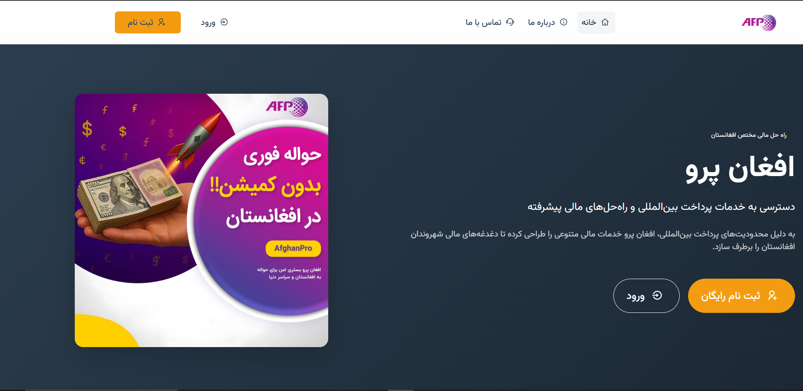
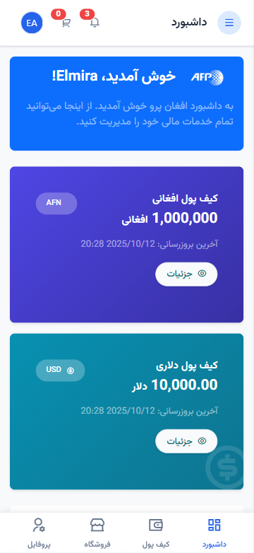
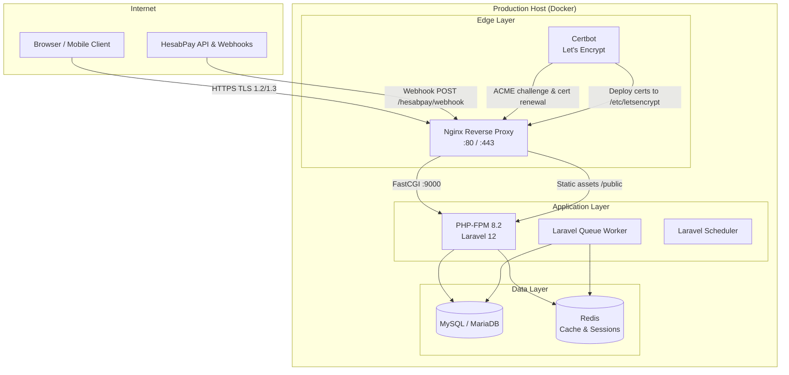

# AfghanPro

[](https://afghanpro.ashrafisolutions.com)

**Live Site:** [https://afghanpro.ashrafisolutions.com](https://afghanpro.ashrafisolutions.com)

**AfghanPro** is a full-stack financial services and e-learning platform built for users in Afghanistan. It addresses international payment restrictions by combining dual-currency digital wallets, an online shop, course delivery, agency-based cash operations, and HesabPay payment integration — all in a single Laravel application with a Persian RTL interface.

> Portfolio project by [Elmira Ashrafi](https://github.com/elmira-ashrafi)

---

## Screenshots

### Landing Page



### User Dashboard (Mobile)



---

## Production Infrastructure

The live deployment at [afghanpro.ashrafisolutions.com](https://afghanpro.ashrafisolutions.com) runs on a **containerized, reverse-proxied stack** designed for production-grade Laravel hosting: isolated services via Docker, HTTP/HTTPS termination and routing via Nginx, and automated TLS certificate lifecycle management through **Let's Encrypt** and **Certbot**.

### Architecture Overview



### Docker Containerization

The application is decomposed into **single-responsibility containers** orchestrated with Docker Compose. Each service runs in an isolated namespace with its own filesystem, network interface, and resource limits — improving reproducibility, rollback safety, and environment parity between staging and production.

| Container | Role | Responsibility |
|-----------|------|----------------|
| **nginx** | Reverse proxy & web server | Terminates TLS, serves static files, routes requests to PHP-FPM, enforces security headers |
| **php-fpm** | Application runtime | Executes Laravel via FastCGI; runs `artisan` commands during deploy |
| **mysql** (or **mariadb**) | Primary datastore | Persistent relational storage for users, wallets, orders, transactions |
| **redis** | In-memory store | Session storage, cache layer, queue backend for async jobs |
| **queue-worker** | Background processor | Runs `php artisan queue:work` for payment callbacks, notifications |
| **scheduler** | Cron replacement | Executes `php artisan schedule:run` every minute via container cron |
| **certbot** | Certificate manager | Obtains and renews Let's Encrypt certificates; reloads Nginx on success |

**Key design decisions:**

- **Immutable application image** — The PHP-FPM image is built from a `Dockerfile` with pinned PHP extensions (`pdo_mysql`, `mbstring`, `openssl`, `bcmath`, `gd`, `zip`, `intl`) required by Laravel and payment integrations.
- **Volume-mounted persistence** — Database data, Redis snapshots, Laravel `storage/` (uploads, logs), and Let's Encrypt certificates are stored on named Docker volumes so containers can be recreated without data loss.
- **Internal bridge network** — Containers communicate over a private Docker network (`app-network`). Only Nginx exposes ports `80` and `443` to the host; PHP-FPM and the database are not reachable from the public internet.
- **Environment injection** — Production secrets (`APP_KEY`, `HESABPAY_API_KEY`, database credentials) are injected via `.env` mounted as a read-only volume or Docker secrets — never baked into the image.

```yaml
# Simplified docker-compose service topology
services:
  nginx:
    image: nginx:alpine
    ports: ["80:80", "443:443"]
    volumes:
      - ./nginx/conf.d:/etc/nginx/conf.d:ro
      - ./public:/var/www/html/public:ro
      - certbot-certs:/etc/letsencrypt:ro
    depends_on: [php-fpm]

  php-fpm:
    build: ./docker/php
    volumes:
      - .:/var/www/html
    depends_on: [mysql, redis]

  mysql:
    image: mysql:8.0
    volumes: [db-data:/var/lib/mysql]

  redis:
    image: redis:alpine

  queue-worker:
    build: ./docker/php
    command: php artisan queue:work --sleep=3 --tries=3

  certbot:
    image: certbot/certbot
    volumes:
      - certbot-certs:/etc/letsencrypt
      - certbot-webroot:/var/www/certbot
```

### Nginx Reverse Proxy Configuration

Nginx acts as the **sole entry point** for all inbound traffic. It handles three distinct responsibilities that PHP-FPM should never perform directly in production:

1. **TLS termination** — Decrypts HTTPS before forwarding to upstream services
2. **Static asset delivery** — Serves files from `public/` (images, fonts, compiled CSS/JS) directly without invoking PHP
3. **Front-controller routing** — Rewrites all dynamic requests to `public/index.php` (Laravel's single entry point)

```nginx
# /etc/nginx/conf.d/afghanpro.conf (production)

# HTTP → HTTPS redirect
server {
    listen 80;
    listen [::]:80;
    server_name afghanpro.ashrafisolutions.com;

    # ACME HTTP-01 challenge (used by Certbot)
    location /.well-known/acme-challenge/ {
        root /var/www/certbot;
    }

    location / {
        return 301 https://$host$request_uri;
    }
}

# HTTPS — primary server block
server {
    listen 443 ssl http2;
    listen [::]:443 ssl http2;
    server_name afghanpro.ashrafisolutions.com;

    root /var/www/html/public;
    index index.php;

    # TLS certificates (managed by Certbot)
    ssl_certificate     /etc/letsencrypt/live/afghanpro.ashrafisolutions.com/fullchain.pem;
    ssl_certificate_key /etc/letsencrypt/live/afghanpro.ashrafisolutions.com/privkey.pem;
    ssl_trusted_certificate /etc/letsencrypt/live/afghanpro.ashrafisolutions.com/chain.pem;

    # Modern TLS configuration
    ssl_protocols TLSv1.2 TLSv1.3;
    ssl_ciphers ECDHE-ECDSA-AES128-GCM-SHA256:ECDHE-RSA-AES128-GCM-SHA256:ECDHE-ECDSA-AES256-GCM-SHA384:ECDHE-RSA-AES256-GCM-SHA384;
    ssl_prefer_server_ciphers off;
    ssl_session_cache shared:SSL:10m;
    ssl_session_timeout 1d;
    ssl_session_tickets off;

    # Security headers
    add_header Strict-Transport-Security "max-age=63072000; includeSubDomains; preload" always;
    add_header X-Frame-Options "SAMEORIGIN" always;
    add_header X-Content-Type-Options "nosniff" always;
    add_header Referrer-Policy "strict-origin-when-cross-origin" always;

    # Gzip compression
    gzip on;
    gzip_types text/plain text/css application/json application/javascript text/xml application/xml;

    # Max upload size (product images, CSV imports)
    client_max_body_size 32M;

    # Laravel front-controller pattern
    location / {
        try_files $uri $uri/ /index.php?$query_string;
    }

    # PHP-FPM upstream via Docker internal network
    location ~ \.php$ {
        fastcgi_pass php-fpm:9000;
        fastcgi_param SCRIPT_FILENAME $realpath_root$fastcgi_script_name;
        include fastcgi_params;
        fastcgi_hide_header X-Powered-By;
        fastcgi_read_timeout 300;
    }

    # Deny access to hidden files (.env, .git)
    location ~ /\.(?!well-known).* {
        deny all;
    }

    # Cache static assets aggressively
    location ~* \.(jpg|jpeg|png|gif|ico|css|js|webp|woff2|svg)$ {
        expires 30d;
        add_header Cache-Control "public, immutable";
        access_log off;
    }
}
```

**HesabPay webhook handling:** Payment gateway callbacks (`POST /hesabpay/webhook`) and redirect URLs (`/hesabpay/callback`, `/payment/success`, `/payment/fail`) are routed through the same Nginx → PHP-FPM pipeline. Nginx preserves the original `X-Forwarded-Proto` and `X-Forwarded-For` headers so Laravel correctly generates HTTPS URLs and logs client IPs behind the proxy.

### SSL/TLS with Let's Encrypt & Certbot

All traffic to the production domain is encrypted with **free, auto-renewing TLS certificates** issued by [Let's Encrypt](https://letsencrypt.org) via [Certbot](https://certbot.eff.org). This eliminates manual certificate management and ensures the platform maintains an A-grade SSL configuration.

#### Initial Certificate Provisioning

Certbot uses the **HTTP-01 ACME challenge** during first-time setup:

1. Certbot requests a certificate for `afghanpro.ashrafisolutions.com` from the Let's Encrypt CA
2. The CA responds with a challenge token
3. Certbot writes the token to `/var/www/certbot/.well-known/acme-challenge/`
4. Nginx serves this path on port 80 (the dedicated `location` block above)
5. The CA verifies domain ownership over HTTP and issues the certificate
6. Certbot stores the certificate chain at `/etc/letsencrypt/live/afghanpro.ashrafisolutions.com/`

```bash
# Initial certificate issuance (run once)
docker compose run --rm certbot certonly \
  --webroot \
  --webroot-path=/var/www/certbot \
  --email elmiraashrafiiii@gmail.com \
  --agree-tos \
  --no-eff-email \
  -d afghanpro.ashrafisolutions.com
```

#### Automated Renewal

Let's Encrypt certificates expire every **90 days**. Certbot handles renewal automatically via a scheduled job:

```bash
# Cron entry on the host (runs twice daily)
0 3,15 * * * docker compose run --rm certbot renew --quiet \
  && docker compose exec nginx nginx -s reload
```

The renewal process:

1. **Certbot checks expiry** — If the certificate has fewer than 30 days remaining, renewal is triggered
2. **ACME challenge repeats** — Same HTTP-01 flow validates continued domain control
3. **Certificate replaced in-place** — New certs are written to `/etc/letsencrypt/live/` (symlinks updated atomically)
4. **Nginx graceful reload** — `nginx -s reload` loads the new certificates **without dropping active connections** — critical for a financial platform with ongoing payment sessions

#### TLS Security Posture

| Property | Configuration |
|----------|---------------|
| **Protocols** | TLS 1.2 and TLS 1.3 only (TLS 1.0/1.1 disabled) |
| **Cipher suites** | ECDHE forward-secrecy ciphers with AES-GCM |
| **HSTS** | `max-age=63072000` (2 years) with `includeSubDomains` |
| **OCSP Stapling** | Enabled via `ssl_trusted_certificate` for faster handshake validation |
| **HTTP → HTTPS** | Permanent 301 redirect on port 80 |
| **Certificate authority** | Let's Encrypt (ISRG Root X1) — trusted by all major browsers |

### Request Lifecycle (End-to-End)

```
Client HTTPS request
    │
    ▼
Nginx :443 — TLS decryption, security headers, static file check
    │
    ├── Static asset? → Serve from /public (cached 30 days)
    │
    └── Dynamic route? → FastCGI pass to php-fpm:9000
            │
            ▼
        Laravel Kernel → Middleware pipeline → Controller
            │
            ├── Database query (MySQL via PDO)
            ├── Cache read/write (Redis)
            ├── HesabPay API call (outbound HTTPS)
            └── Queue job dispatch (async processing)
            │
            ▼
        Blade view rendered → Response
    │
    ▼
Nginx — Gzip compression → Encrypted HTTPS response → Client
```

### Deployment Workflow

Production deployments follow a zero-downtime rolling update pattern:

```bash
# 1. Pull latest code
git pull origin main

# 2. Rebuild PHP image if Dockerfile changed
docker compose build php-fpm

# 3. Install dependencies & run migrations inside the container
docker compose exec php-fpm composer install --no-dev --optimize-autoloader
docker compose exec php-fpm php artisan migrate --force

# 4. Cache Laravel configuration for production performance
docker compose exec php-fpm php artisan config:cache
docker compose exec php-fpm php artisan route:cache
docker compose exec php-fpm php artisan view:cache

# 5. Build frontend assets
docker compose exec php-fpm npm ci && npm run build

# 6. Restart workers to pick up new code
docker compose restart php-fpm queue-worker

# 7. Verify health endpoint
curl -f https://afghanpro.ashrafisolutions.com/up
```

---

## Project Overview

AfghanPro is designed as a comprehensive fintech platform that bridges online and offline financial services for Afghan users. The application provides:

- **Digital wallets** in Afghan Afghani (AFN) and US Dollars (USD)
- **Online payments** through the HesabPay gateway for wallet top-ups
- **Physical agency network** for cash deposits and withdrawals
- **E-commerce shop** for premium accounts and digital products
- **Learning management system** for online courses with video delivery
- **Admin panel** for operations, user management, and payment reconciliation

The platform uses phone-number-based authentication, operates in the Afghanistan timezone (`Asia/Kabul`), and delivers a fully responsive Persian RTL experience across public pages, user dashboards, and admin panels.

---

## Main Features

### Authentication & User Management
- Phone-number registration and login with optional email
- Phone verification flow (extensible for SMS integration)
- Password reset workflow
- Role-based access: regular users, support staff, and administrators
- User profile and password management

### Dual-Currency Wallets
- Separate AFN and USD wallets per user, created automatically on registration
- Transaction ledger with polymorphic references (deposits, withdrawals, orders, payments)
- Wallet deposit history and balance overview
- Admin tools to view and adjust wallet balances

### HesabPay Payment Integration
- Online AFN wallet top-up via HesabPay payment sessions
- Callback, webhook, and success/failure route handling
- Mock payment flow for local development and testing
- Admin panel for payment reconciliation (mark complete/failed)

### Agency Network
- Physical agency locations for offline cash operations
- Agency withdrawal requests with admin approval workflow
- Agency visit checkout option in the shop

### E-Commerce Shop
- Product catalog with categories, attributes, and variations
- Session-based shopping cart with AJAX add/update/remove
- Coupon engine with discount validation at checkout
- Checkout via wallet balance or agency visit
- Order history, cancellation, and admin order management
- CSV bulk product import

### Course Platform (LMS)
- Course catalog organized by categories
- Course enrollment and progress tracking
- Video delivery via external URLs organized in sections
- Admin CRUD for courses, sections, and videos
- CSV bulk course import

### Admin Panel
- Dashboard with recent activity overview
- User and support staff management
- Wallet and transaction administration
- Product, category, coupon, and order management
- Agency and agency withdrawal management
- HesabPay payment oversight
- System settings (fees, exchange rates, limits)

### Planned / Schema-Ready Modules
Database migrations and models exist for future phases:
- Money transfers (domestic and international)
- Trade account funding and withdrawals
- Currency conversion (AFN ↔ USD)

---

## Technologies & Frameworks

| Layer | Technology |
|-------|------------|
| **Backend** | PHP 8.2+, Laravel 12 |
| **Database** | SQLite (default), configurable via Laravel DB layer |
| **Authentication** | Laravel session auth (web), Laravel Sanctum (API-ready) |
| **Frontend** | Blade templates, Bootstrap 5 RTL, Remixicon |
| **Typography** | Vazirmatn, IranSans (Persian fonts) |
| **Build Tools** | Vite 6, Tailwind CSS 4, Axios |
| **Payments** | HesabPay API |
| **Testing** | PHPUnit 11 |
| **Code Style** | Laravel Pint |

---

## Architecture & Project Structure

```
afghanpro-website/
├── app/
│   ├── Console/Commands/       # Artisan commands (test data, demo products)
│   ├── Http/
│   │   ├── Controllers/
│   │   │   ├── Auth/           # Login, register, verification
│   │   │   ├── Dashboard/      # Shop, wallets, courses, admin
│   │   │   └── HesabPayController.php
│   │   └── Middleware/         # AdminMiddleware, auth guards
│   ├── Models/                 # 25 Eloquent models
│   └── Providers/
├── database/
│   ├── factories/              # Model factories for testing/seeding
│   ├── migrations/             # 38 migrations
│   └── seeders/                # Default users and system settings
├── public/                     # Web root, fonts, images, samples
├── resources/
│   ├── css/                    # Tailwind entry point
│   ├── js/                     # Vite/Axios bootstrap
│   └── views/
│       ├── auth/               # Login, register, verify
│       ├── dashboard/          # User dashboard, shop, courses
│       ├── dashboard/admin/    # Admin panel views
│       ├── hesabpay/           # Mock payment UI
│       └── layouts/            # app, dashboard, admin layouts
├── routes/
│   ├── web.php                 # All application routes
│   └── api.php                 # Sanctum user endpoint (scaffolded)
├── tests/                      # PHPUnit test suites
└── .github/workflows/          # CI pipeline
```

### Key Design Decisions

- **Web-first architecture** — All primary features are served through Blade views and session auth. API routes are scaffolded with Sanctum for future mobile or third-party integrations.
- **Controller-centric logic** — Business logic lives in controllers rather than a separate service layer, keeping the codebase approachable for a monolithic Laravel app.
- **Polymorphic transaction ledger** — A single `transactions` table records all financial activity with `reference_type` and `reference_id` for traceability.
- **Shared-hosting support** — `bootstrap/app.php` configures the public path for deployment on shared hosting environments.

---

## Installation & Setup

### Prerequisites

- PHP 8.2 or higher with extensions: `pdo`, `pdo_sqlite`, `mbstring`, `openssl`, `tokenizer`, `xml`, `ctype`, `json`, `bcmath`
- [Composer](https://getcomposer.org/)
- [Node.js](https://nodejs.org/) 18+ and npm (for frontend assets)

### Steps

1. **Clone the repository**

   ```bash
   git clone https://github.com/elmira-ashrafi/afghanpro-website.git
   cd afghanpro-website
   ```

2. **Install PHP dependencies**

   ```bash
   composer install
   ```

3. **Install Node dependencies**

   ```bash
   npm install
   ```

4. **Configure environment**

   ```bash
   cp .env.example .env
   php artisan key:generate
   ```

5. **Create the SQLite database**

   ```bash
   touch database/database.sqlite
   ```

6. **Run migrations and seeders**

   ```bash
   php artisan migrate --seed
   ```

7. **Link storage (for file uploads)**

   ```bash
   php artisan storage:link
   ```

8. **Start the development server**

   ```bash
   composer dev
   ```

   This runs the Laravel server, queue worker, log viewer, and Vite dev server concurrently. Alternatively:

   ```bash
   php artisan serve
   ```

9. **Open the application**

   Visit [http://localhost:8000](http://localhost:8000)

### Environment Variables

| Variable | Description |
|----------|-------------|
| `APP_NAME` | Application name (default: AfghanPro) |
| `APP_URL` | Base URL for the application |
| `APP_TIMEZONE` | Timezone (default: Asia/Kabul) |
| `DB_CONNECTION` | Database driver (default: sqlite) |
| `HESABPAY_API_KEY` | HesabPay API key for online payments |

See `.env.example` for the full list of configuration options.

---

## Usage

### Default Seeded Accounts

After running `php artisan migrate --seed`, these accounts are available:

| Role | Email | Phone | Password |
|------|-------|-------|----------|
| Admin | admin@afghanpro.af | 93700000001 | admin123 |
| Support | support@afghanpro.af | 93700000002 | support123 |
| User | user@example.com | 93700000003 | user123 |

### User Workflow

1. Register with a phone number or log in with seeded credentials
2. View wallet balances on the dashboard
3. Top up AFN wallet via HesabPay (or use mock payment in development)
4. Browse the shop, add products to cart, apply coupons, and checkout
5. Enroll in courses and watch video lessons
6. Request agency withdrawals for cash pickup

### Admin Workflow

1. Log in as admin and navigate to `/dashboard/admin`
2. Manage users, wallets, products, orders, and coupons
3. Review and approve agency withdrawal requests
4. Reconcile HesabPay payments
5. Configure system settings (fees, exchange rates)

### Artisan Commands

```bash
# Reset database with test data and sample images
php artisan setup:test-data

# Add demo shop products
php artisan shop:add-demo-products

# Download placeholder product images
php artisan products:download-images
```

---

## API Overview

The application is primarily web-based. A minimal API scaffold exists for future expansion:

| Method | Endpoint | Auth | Description |
|--------|----------|------|-------------|
| `GET` | `/api/user` | Sanctum | Returns authenticated user (scaffolded, not registered in routing) |

Laravel Sanctum is installed and `HasApiTokens` is enabled on the `User` model. To activate API routes, register `routes/api.php` in `bootstrap/app.php`.

### HesabPay Webhooks

| Method | Endpoint | Description |
|--------|----------|-------------|
| `GET` | `/hesabpay/callback` | Payment callback from HesabPay |
| `POST` | `/hesabpay/webhook` | Async payment notification webhook |
| `GET` | `/payment/success` | User-facing success page |
| `GET` | `/payment/fail` | User-facing failure page |

---

## Testing

The project includes PHPUnit with example unit and feature tests. Tests run against an in-memory SQLite database.

```bash
# Run all tests
composer test

# Or directly
php artisan test
```

### CI/CD

GitHub Actions runs the test suite on every push and pull request to `main`. See `.github/workflows/tests.yml`.

---

## Deployment Notes

> For the full production stack (Docker, Nginx, Let's Encrypt), see the [Production Infrastructure](#production-infrastructure) section above.

### Shared Hosting

The project also includes shared-hosting compatibility for environments without Docker:

- `bootstrap/app.php` sets a custom public path
- `public/clear-cash.php` and `public/storage.php` helpers for cache management

### Production Checklist

1. Set `APP_ENV=production` and `APP_DEBUG=false`
2. Configure a production database (MySQL/PostgreSQL recommended over SQLite)
3. Set a strong `APP_KEY` via `php artisan key:generate`
4. Configure `HESABPAY_API_KEY` with production credentials
5. Run `php artisan config:cache`, `route:cache`, and `view:cache`
6. Build frontend assets: `npm run build`
7. Set up a queue worker for background jobs: `php artisan queue:work`
8. Configure a cron job for Laravel scheduler if needed

### Security Considerations

- Never commit `.env` or API keys to version control
- Shop admin routes under `/dashboard/shop/admin` should be protected with `AdminMiddleware` in production
- Phone verification and password reset are stubbed — integrate an SMS provider before production use

---

## Author

**Elmira Ashrafi**

- GitHub: [@elmira-ashrafi](https://github.com/elmira-ashrafi)

---

## License

This project is licensed under the [MIT License](LICENSE).
