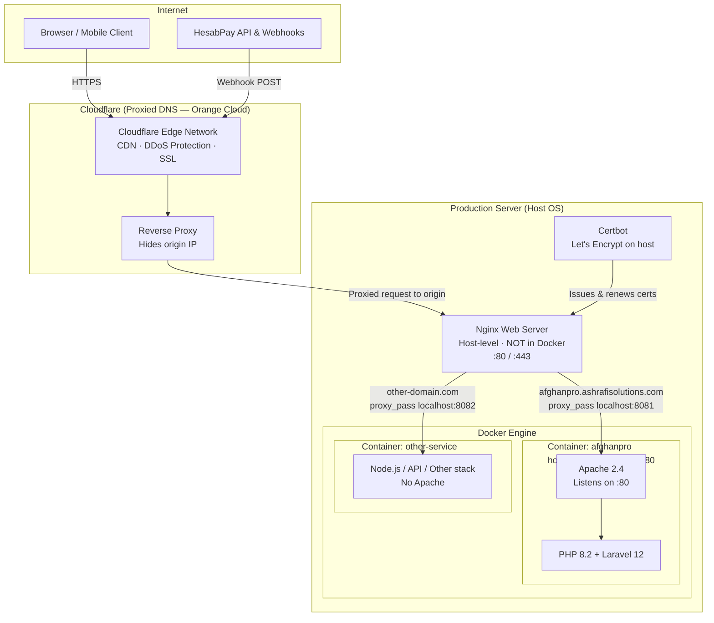

# AfghanPro

[](https://afghanpro.ashrafisolutions.com)

**Live Site:** [https://afghanpro.ashrafisolutions.com](https://afghanpro.ashrafisolutions.com)

**AfghanPro** is a full-stack financial services and e-learning platform built for users in Afghanistan. It addresses international payment restrictions by combining dual-currency digital wallets, an online shop, course delivery, agency-based cash operations, and HesabPay payment integration — all in a single Laravel application with a Persian RTL interface.

> Portfolio project by [Elmira Ashrafi](https://github.com/elmira-ashrafi)

---

## Screenshots

### Landing Page


### User Dashboard (Mobile)


---

## Production Infrastructure

The live deployment at [afghanpro.ashrafisolutions.com](https://afghanpro.ashrafisolutions.com) runs on a **multi-layer reverse-proxy architecture**: domains are proxied through **Cloudflare**, the host-level **Nginx** web server routes traffic by domain to isolated **Docker containers** — each container exposing a mapped host port. The AfghanPro application specifically runs inside a container where **Apache listens on port 80** and serves PHP to execute Laravel. Other containers on the same server may run entirely different stacks (Node.js, Python, databases, etc.) without Apache.

### Architecture Overview



### Request Flow (Layer by Layer)

Every request passes through **three reverse-proxy layers** before reaching Laravel:

```
┌─────────────┐     ┌──────────────────┐     ┌─────────────────────┐     ┌──────────────────────────────┐
│   Client    │────▶│    Cloudflare    │────▶│  Host Nginx         │────▶│  Docker Container            │
│  (Browser)  │     │  Reverse Proxy   │     │  (Web Server)       │     │  (stack varies per container)│
└─────────────┘     └──────────────────┘     └─────────────────────┘     └──────────────────────────────┘
                    Proxied DNS (🟠)           Routes by domain           AfghanPro: Apache :80 → PHP
                    CDN + DDoS + SSL           Forwards to host port      Others: Node, API, DB, etc.
```

| Layer | Component | Role |
|-------|-----------|------|
| **1 — Edge** | Cloudflare | DNS proxy, CDN caching, DDoS mitigation, client-facing SSL/TLS |
| **2 — Origin routing** | Nginx (host) | Virtual host per domain; forwards each domain to its container's mapped host port |
| **3 — Application** | Docker container | Isolated runtime per service; AfghanPro uses Apache on port 80 + PHP — other containers may use a completely different stack |

---

### Layer 1: Cloudflare (Proxied Domains)

All production domains are configured in **Cloudflare with proxy enabled** (orange cloud icon). This means Cloudflare sits in front of the origin server as a **reverse proxy** — clients never connect directly to the server IP.

**What Cloudflare handles:**

| Feature | Benefit |
|---------|---------|
| **Proxied DNS** | Origin server IP is hidden; traffic always flows through Cloudflare's edge network |
| **CDN caching** | Static assets (images, CSS, JS, fonts) are cached at 300+ global edge locations |
| **DDoS protection** | Layer 3/4 and Layer 7 attack mitigation before traffic reaches the origin |
| **SSL/TLS at edge** | Client-to-Cloudflare connection is encrypted (Flexible, Full, or Full Strict mode) |
| **HTTP/2 & HTTP/3** | Modern protocol support at the edge without origin configuration |
| **WAF (optional)** | Web Application Firewall rules to block malicious requests |

**DNS configuration:**

```
Type    Name                              Value              Proxy
────    ────                              ─────              ─────
A       afghanpro.ashrafisolutions.com    <origin-server-IP>  🟠 Proxied
CNAME   www                               afghanpro...        🟠 Proxied
```

With proxy enabled, Cloudflare resolves the domain to its own edge IPs — not the origin server's real IP. All inbound HTTP/HTTPS traffic is terminated at Cloudflare and re-forwarded to the origin.

**Headers forwarded to origin:**

Cloudflare injects headers that Nginx and Laravel rely on to identify the real client and protocol:

| Header | Purpose |
|--------|---------|
| `CF-Connecting-IP` | Real client IP address (used instead of Cloudflare's edge IP) |
| `X-Forwarded-For` | Proxy chain of client IPs |
| `X-Forwarded-Proto` | Original protocol (`https`) — critical for Laravel `APP_URL` and secure cookies |
| `CF-Ray` | Unique request ID for debugging across Cloudflare and origin logs |
| `CF-Visitor` | JSON blob indicating whether the client used HTTPS |

---

### Layer 2: Host Nginx (Reverse Proxy — Not in Docker)

**Nginx is installed directly on the host operating system**, not inside a Docker container. It is the **origin web server** that Cloudflare connects to. Its sole job in this architecture is **domain-based routing**: receive the proxied request from Cloudflare and forward it to the correct Docker container via a **host port mapping**.

This is a **multi-tenant setup** — a single Nginx instance serves multiple domains, each pointing to a different container on its own mapped host port. Containers are independent: some run Apache + PHP, others may run Node.js, Python, or any other service entirely.

```
Cloudflare request for afghanpro.ashrafisolutions.com
    → Host Nginx matches server_name
    → proxy_pass http://127.0.0.1:8081   → AfghanPro container (Apache :80)

Cloudflare request for another-domain.com
    → Host Nginx matches server_name
    → proxy_pass http://127.0.0.1:8082   → Different container (may not use Apache at all)
```

```nginx
# /etc/nginx/sites-available/afghanpro.ashrafisolutions.com
# Nginx runs on the HOST — routes to Docker container via mapped port

server {
    listen 80;
    listen [::]:80;
    server_name afghanpro.ashrafisolutions.com;

    # ACME HTTP-01 challenge for Certbot (Let's Encrypt)
    location /.well-known/acme-challenge/ {
        root /var/www/certbot;
    }

    location / {
        return 301 https://$host$request_uri;
    }
}

server {
    listen 443 ssl http2;
    listen [::]:443 ssl http2;
    server_name afghanpro.ashrafisolutions.com;

    # TLS certificates issued by Certbot on the host
    ssl_certificate     /etc/letsencrypt/live/afghanpro.ashrafisolutions.com/fullchain.pem;
    ssl_certificate_key /etc/letsencrypt/live/afghanpro.ashrafisolutions.com/privkey.pem;

    ssl_protocols TLSv1.2 TLSv1.3;
    ssl_prefer_server_ciphers off;

    # Trust Cloudflare IPs for real client IP resolution
    set_real_ip_from 173.245.48.0/20;
    set_real_ip_from 103.21.244.0/22;
    # ... (all Cloudflare IP ranges)
    real_ip_header CF-Connecting-IP;

    client_max_body_size 32M;

    # Forward entire request to the Docker container's mapped host port
    # Container internally runs Apache on port 80
    location / {
        proxy_pass         http://127.0.0.1:8081;
        proxy_http_version 1.1;
        proxy_set_header   Host              $host;
        proxy_set_header   X-Real-IP         $remote_addr;
        proxy_set_header   X-Forwarded-For   $proxy_add_x_forwarded_for;
        proxy_set_header   X-Forwarded-Proto $scheme;
        proxy_set_header   Upgrade           $http_upgrade;
        proxy_set_header   Connection        "upgrade";
        proxy_read_timeout 300;
    }
}
```

**Why Nginx is on the host and not in Docker:**

- A **single Nginx** can route dozens of domains to dozens of containers without running a separate Nginx per container
- **SSL certificates** are managed once on the host via Certbot — not duplicated inside every container
- **Port 80/443** are bound only on the host; containers expose arbitrary high ports (8081, 8082, …) mapped via Docker's `-p` flag
- Adding a new site = new container + new Nginx `server` block — no changes to existing containers

---

### Layer 3: AfghanPro Docker Container (Apache + PHP)

The AfghanPro Laravel application runs in its **own isolated Docker container**. Not every container on the server follows this pattern — only PHP/Laravel applications use Apache. Other containers on the same host may run Node.js APIs, background workers, databases, or other services with no Apache involved.

**Inside the AfghanPro container**, Apache 2.4 listens on port 80 and handles PHP execution via `mod_php` or `php-fpm` proxied through Apache:

```yaml
# docker-compose.yml (per application)
services:
  afghanpro:
    image: php:8.2-apache          # Apache + PHP in one image
    container_name: afghanpro
    ports:
      - "8081:80"                  # Host port 8081 → Container port 80
    volumes:
      - ./:/var/www/html
    environment:
      - APACHE_DOCUMENT_ROOT=/var/www/html/public
    restart: unless-stopped
```

**Inside the container:**

| Component | Details |
|-----------|---------|
| **Apache** | Listens on port 80 inside the container; serves as the web server and PHP handler |
| **PHP 8.2** | Executes Laravel via Apache's `mod_php` or `proxy:fcgi` to PHP-FPM |
| **Document root** | `/var/www/html/public` — Laravel's front-controller entry point |
| **Port mapping** | `8081:80` — only this host port is exposed; Apache is never directly reachable from the internet |

```apache
# Apache VirtualHost inside the container
<VirtualHost *:80>
    DocumentRoot /var/www/html/public

    <Directory /var/www/html/public>
        AllowOverride All
        Require all granted
    </Directory>

    # Laravel front-controller rewrite
    <IfModule mod_rewrite.c>
        RewriteEngine On
        RewriteCond %{REQUEST_FILENAME} !-d
        RewriteCond %{REQUEST_FILENAME} !-f
        RewriteRule ^ index.php [L]
    </IfModule>

    ErrorLog ${APACHE_LOG_DIR}/error.log
    CustomLog ${APACHE_LOG_DIR}/access.log combined
</VirtualHost>
```

**Container isolation benefits:**

- AfghanPro's PHP runtime, Apache config, and Laravel codebase are fully isolated from other services
- A crash or misconfiguration in one container does not affect other sites on the same server
- Containers can be independently updated, restarted, or rolled back
- Resource limits (`--memory`, `--cpus`) can be applied per container

---

### SSL/TLS with Let's Encrypt & Certbot (Host-Level)

TLS certificates are issued on the **host Nginx** (not inside Docker containers) using **Let's Encrypt** via **Certbot**. This pairs with Cloudflare's **Full (Strict)** SSL mode — Cloudflare encrypts traffic to the client *and* to the origin server.

```
Client ──[HTTPS/TLS]──▶ Cloudflare Edge ──[HTTPS/TLS]──▶ Host Nginx (Let's Encrypt cert) ──[HTTP]──▶ AfghanPro container (Apache :80)
```

| SSL Mode | Client → Cloudflare | Cloudflare → Origin |
|----------|--------------------|--------------------|
| Flexible | HTTPS | HTTP (not recommended) |
| Full | HTTPS | HTTPS (self-signed origin cert accepted) |
| **Full (Strict)** | HTTPS | HTTPS (valid Let's Encrypt origin cert required) |

**Initial certificate provisioning (on the host):**

```bash
# Run on the host OS (not inside Docker)
certbot certonly \
  --webroot \
  --webroot-path=/var/www/certbot \
  --email elmiraashrafiiii@gmail.com \
  --agree-tos \
  --no-eff-email \
  -d afghanpro.ashrafisolutions.com
```

**Automated renewal (host cron):**

```bash
# /etc/cron.d/certbot — runs twice daily on the host
0 3,15 * * * certbot renew --quiet --deploy-hook "systemctl reload nginx"
```

Renewal flow:

1. Certbot checks if the certificate expires within 30 days
2. HTTP-01 ACME challenge is served by host Nginx via `/.well-known/acme-challenge/`
3. Let's Encrypt validates domain ownership and issues a new certificate
4. Certbot replaces certs at `/etc/letsencrypt/live/` (atomic symlink swap)
5. `systemctl reload nginx` loads new certs **without dropping active connections**

**Cloudflare + Let's Encrypt interaction:**

- Cloudflare proxy must be **temporarily disabled** (grey cloud) during initial certificate issuance, OR use **DNS-01 challenge** via Cloudflare API to avoid this
- Once issued, re-enable Cloudflare proxy (orange cloud) and set SSL mode to **Full (Strict)**
- Cloudflare's **Origin CA** certificates are an alternative to Let's Encrypt for origin encryption

---

### End-to-End Request Lifecycle

```
1. User visits https://afghanpro.ashrafisolutions.com
        │
        ▼
2. DNS resolves to Cloudflare edge IP (proxied / orange cloud)
        │
        ▼
3. Cloudflare terminates client TLS, applies WAF/CDN rules,
   forwards request to origin server IP on port 443
   (injects CF-Connecting-IP, X-Forwarded-Proto headers)
        │
        ▼
4. Host Nginx receives HTTPS request
   - Matches server_name: afghanpro.ashrafisolutions.com
   - Decrypts TLS using Let's Encrypt certificate
   - proxy_pass → http://127.0.0.1:8081
        │
        ▼
5. Docker port mapping: host :8081 → AfghanPro container :80
        │
        ▼
6. Apache inside the AfghanPro container receives HTTP request
   - Serves static files directly from /public
   - Rewrites dynamic routes to index.php
   - mod_php executes Laravel
        │
        ▼
7. Laravel handles request
   - Middleware pipeline (auth, CSRF, session)
   - Controller logic (wallet, shop, HesabPay callback)
   - Database queries, cache reads, queue dispatch
   - Blade view rendered
        │
        ▼
8. Response travels back:
   Apache → Host Nginx → Cloudflare Edge → Client
```

**HesabPay payment callbacks** (`POST /hesabpay/webhook`, `GET /hesabpay/callback`) follow the same path. Laravel reads `X-Forwarded-Proto: https` to generate correct HTTPS URLs and uses `CF-Connecting-IP` for accurate client logging behind both Cloudflare and Nginx.

---

### Deployment Workflow

```bash
# 1. Pull latest code into the project directory
cd /var/www/afghanpro && git pull origin main

# 2. Enter the Docker container
docker exec -it afghanpro bash

# 3. Install dependencies & run migrations
composer install --no-dev --optimize-autoloader
php artisan migrate --force

# 4. Cache Laravel for production
php artisan config:cache
php artisan route:cache
php artisan view:cache

# 5. Build frontend assets
npm ci && npm run build

# 6. Restart the container to apply changes
docker restart afghanpro

# 7. Verify through the full stack
curl -f https://afghanpro.ashrafisolutions.com/up
```

---

## Project Overview

AfghanPro is designed as a comprehensive fintech platform that bridges online and offline financial services for Afghan users. The application provides:

- **Digital wallets** in Afghan Afghani (AFN) and US Dollars (USD)
- **Online payments** through the HesabPay gateway for wallet top-ups
- **Physical agency network** for cash deposits and withdrawals
- **E-commerce shop** for premium accounts and digital products
- **Learning management system** for online courses with video delivery
- **Admin panel** for operations, user management, and payment reconciliation

The platform uses phone-number-based authentication, operates in the Afghanistan timezone (`Asia/Kabul`), and delivers a fully responsive Persian RTL experience across public pages, user dashboards, and admin panels.

---

## Main Features

### Authentication & User Management
- Phone-number registration and login with optional email
- Phone verification flow (extensible for SMS integration)
- Password reset workflow
- Role-based access: regular users, support staff, and administrators
- User profile and password management

### Dual-Currency Wallets
- Separate AFN and USD wallets per user, created automatically on registration
- Transaction ledger with polymorphic references (deposits, withdrawals, orders, payments)
- Wallet deposit history and balance overview
- Admin tools to view and adjust wallet balances

### HesabPay Payment Integration
- Online AFN wallet top-up via HesabPay payment sessions
- Callback, webhook, and success/failure route handling
- Mock payment flow for local development and testing
- Admin panel for payment reconciliation (mark complete/failed)

### Agency Network
- Physical agency locations for offline cash operations
- Agency withdrawal requests with admin approval workflow
- Agency visit checkout option in the shop

### E-Commerce Shop
- Product catalog with categories, attributes, and variations
- Session-based shopping cart with AJAX add/update/remove
- Coupon engine with discount validation at checkout
- Checkout via wallet balance or agency visit
- Order history, cancellation, and admin order management
- CSV bulk product import

### Course Platform (LMS)
- Course catalog organized by categories
- Course enrollment and progress tracking
- Video delivery via external URLs organized in sections
- Admin CRUD for courses, sections, and videos
- CSV bulk course import

### Admin Panel
- Dashboard with recent activity overview
- User and support staff management
- Wallet and transaction administration
- Product, category, coupon, and order management
- Agency and agency withdrawal management
- HesabPay payment oversight
- System settings (fees, exchange rates, limits)

### Planned / Schema-Ready Modules
Database migrations and models exist for future phases:
- Money transfers (domestic and international)
- Trade account funding and withdrawals
- Currency conversion (AFN ↔ USD)

---

## Technologies & Frameworks

| Layer | Technology |
|-------|------------|
| **Backend** | PHP 8.2+, Laravel 12 |
| **Database** | SQLite (default), configurable via Laravel DB layer |
| **Authentication** | Laravel session auth (web), Laravel Sanctum (API-ready) |
| **Frontend** | Blade templates, Bootstrap 5 RTL, Remixicon |
| **Typography** | Vazirmatn, IranSans (Persian fonts) |
| **Build Tools** | Vite 6, Tailwind CSS 4, Axios |
| **Payments** | HesabPay API |
| **Testing** | PHPUnit 11 |
| **Code Style** | Laravel Pint |

---

## Architecture & Project Structure

```
afghanpro-website/
├── app/
│   ├── Console/Commands/       # Artisan commands (test data, demo products)
│   ├── Http/
│   │   ├── Controllers/
│   │   │   ├── Auth/           # Login, register, verification
│   │   │   ├── Dashboard/      # Shop, wallets, courses, admin
│   │   │   └── HesabPayController.php
│   │   └── Middleware/         # AdminMiddleware, auth guards
│   ├── Models/                 # 25 Eloquent models
│   └── Providers/
├── database/
│   ├── factories/              # Model factories for testing/seeding
│   ├── migrations/             # 38 migrations
│   └── seeders/                # Default users and system settings
├── public/                     # Web root, fonts, images, samples
├── resources/
│   ├── css/                    # Tailwind entry point
│   ├── js/                     # Vite/Axios bootstrap
│   └── views/
│       ├── auth/               # Login, register, verify
│       ├── dashboard/          # User dashboard, shop, courses
│       ├── dashboard/admin/    # Admin panel views
│       ├── hesabpay/           # Mock payment UI
│       └── layouts/            # app, dashboard, admin layouts
├── routes/
│   ├── web.php                 # All application routes
│   └── api.php                 # Sanctum user endpoint (scaffolded)
├── tests/                      # PHPUnit test suites
└── .github/workflows/          # CI pipeline
```

### Key Design Decisions

- **Web-first architecture** — All primary features are served through Blade views and session auth. API routes are scaffolded with Sanctum for future mobile or third-party integrations.
- **Controller-centric logic** — Business logic lives in controllers rather than a separate service layer, keeping the codebase approachable for a monolithic Laravel app.
- **Polymorphic transaction ledger** — A single `transactions` table records all financial activity with `reference_type` and `reference_id` for traceability.
- **Shared-hosting support** — `bootstrap/app.php` configures the public path for deployment on shared hosting environments.

---

## Installation & Setup

### Prerequisites

- PHP 8.2 or higher with extensions: `pdo`, `pdo_sqlite`, `mbstring`, `openssl`, `tokenizer`, `xml`, `ctype`, `json`, `bcmath`
- [Composer](https://getcomposer.org/)
- [Node.js](https://nodejs.org/) 18+ and npm (for frontend assets)

### Steps

1. **Clone the repository**

   ```bash
   git clone https://github.com/elmira-ashrafi/afghanpro-website.git
   cd afghanpro-website
   ```

2. **Install PHP dependencies**

   ```bash
composer install
```

3. **Install Node dependencies**

   ```bash
   npm install
```

4. **Configure environment**

   ```bash
cp .env.example .env
php artisan key:generate
```

5. **Create the SQLite database**

   ```bash
   touch database/database.sqlite
   ```

6. **Run migrations and seeders**

   ```bash
php artisan migrate --seed
```

7. **Link storage (for file uploads)**

   ```bash
   php artisan storage:link
   ```

8. **Start the development server**

   ```bash
   composer dev
   ```

   This runs the Laravel server, queue worker, log viewer, and Vite dev server concurrently. Alternatively:

   ```bash
php artisan serve
```

9. **Open the application**

   Visit [http://localhost:8000](http://localhost:8000)

### Environment Variables

| Variable | Description |
|----------|-------------|
| `APP_NAME` | Application name (default: AfghanPro) |
| `APP_URL` | Base URL for the application |
| `APP_TIMEZONE` | Timezone (default: Asia/Kabul) |
| `DB_CONNECTION` | Database driver (default: sqlite) |
| `HESABPAY_API_KEY` | HesabPay API key for online payments |

See `.env.example` for the full list of configuration options.

---

## Usage

### Default Seeded Accounts

After running `php artisan migrate --seed`, these accounts are available:

| Role | Email | Phone | Password |
|------|-------|-------|----------|
| Admin | admin@afghanpro.af | 93700000001 | admin123 |
| Support | support@afghanpro.af | 93700000002 | support123 |
| User | user@example.com | 93700000003 | user123 |

### User Workflow

1. Register with a phone number or log in with seeded credentials
2. View wallet balances on the dashboard
3. Top up AFN wallet via HesabPay (or use mock payment in development)
4. Browse the shop, add products to cart, apply coupons, and checkout
5. Enroll in courses and watch video lessons
6. Request agency withdrawals for cash pickup

### Admin Workflow

1. Log in as admin and navigate to `/dashboard/admin`
2. Manage users, wallets, products, orders, and coupons
3. Review and approve agency withdrawal requests
4. Reconcile HesabPay payments
5. Configure system settings (fees, exchange rates)

### Artisan Commands

```bash
# Reset database with test data and sample images
php artisan setup:test-data

# Add demo shop products
php artisan shop:add-demo-products

# Download placeholder product images
php artisan products:download-images
```

---

## API Overview

The application is primarily web-based. A minimal API scaffold exists for future expansion:

| Method | Endpoint | Auth | Description |
|--------|----------|------|-------------|
| `GET` | `/api/user` | Sanctum | Returns authenticated user (scaffolded, not registered in routing) |

Laravel Sanctum is installed and `HasApiTokens` is enabled on the `User` model. To activate API routes, register `routes/api.php` in `bootstrap/app.php`.

### HesabPay Webhooks

| Method | Endpoint | Description |
|--------|----------|-------------|
| `GET` | `/hesabpay/callback` | Payment callback from HesabPay |
| `POST` | `/hesabpay/webhook` | Async payment notification webhook |
| `GET` | `/payment/success` | User-facing success page |
| `GET` | `/payment/fail` | User-facing failure page |

---

## Testing

The project includes PHPUnit with example unit and feature tests. Tests run against an in-memory SQLite database.

```bash
# Run all tests
composer test

# Or directly
php artisan test
```

### CI/CD

GitHub Actions runs the test suite on every push and pull request to `main`. See `.github/workflows/tests.yml`.

---

## Deployment Notes

> For the full production stack (Docker, Nginx, Let's Encrypt), see the [Production Infrastructure](#production-infrastructure) section above.

### Shared Hosting

The project also includes shared-hosting compatibility for environments without Docker:

- `bootstrap/app.php` sets a custom public path
- `public/clear-cash.php` and `public/storage.php` helpers for cache management

### Production Checklist

1. Set `APP_ENV=production` and `APP_DEBUG=false`
2. Configure a production database (MySQL/PostgreSQL recommended over SQLite)
3. Set a strong `APP_KEY` via `php artisan key:generate`
4. Configure `HESABPAY_API_KEY` with production credentials
5. Run `php artisan config:cache`, `route:cache`, and `view:cache`
6. Build frontend assets: `npm run build`
7. Set up a queue worker for background jobs: `php artisan queue:work`
8. Configure a cron job for Laravel scheduler if needed

### Security Considerations

- Never commit `.env` or API keys to version control
- Shop admin routes under `/dashboard/shop/admin` should be protected with `AdminMiddleware` in production
- Phone verification and password reset are stubbed — integrate an SMS provider before production use

---

## Author

**Elmira Ashrafi**

- GitHub: [@elmira-ashrafi](https://github.com/elmira-ashrafi)

---

## License

This project is licensed under the [MIT License](LICENSE).
