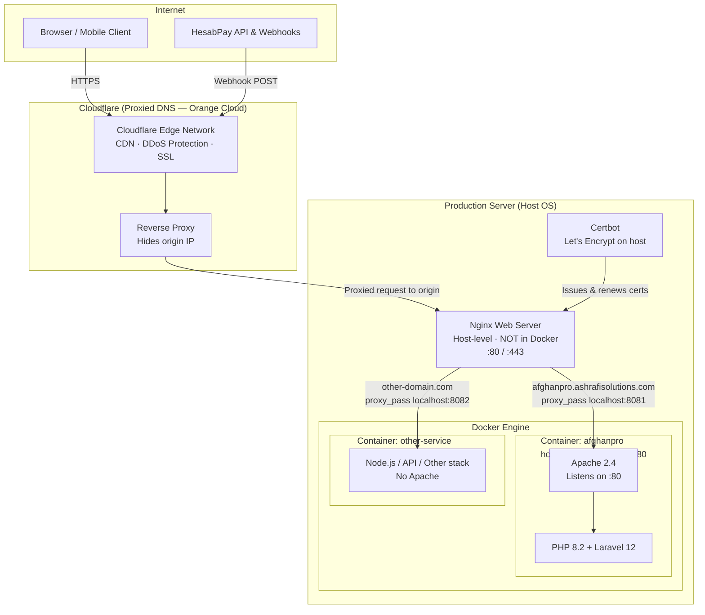
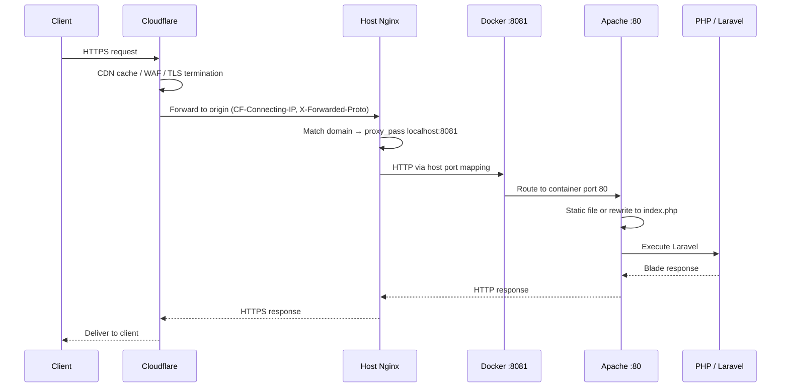

# AfghanPro

[](https://afghanpro.ashrafisolutions.com)

**Live Site:** [https://afghanpro.ashrafisolutions.com](https://afghanpro.ashrafisolutions.com)

**AfghanPro** is a full-stack financial services and e-learning platform built for users in Afghanistan. It addresses international payment restrictions by combining dual-currency digital wallets, an online shop, course delivery, agency-based cash operations, and HesabPay payment integration — all in a single Laravel application with a Persian RTL interface.

> Portfolio project by [Elmira Ashrafi](https://github.com/elmira-ashrafi)

---

## Screenshots

### Landing Page


### User Dashboard (Mobile)


---

## Production Infrastructure

The live deployment at [afghanpro.ashrafisolutions.com](https://afghanpro.ashrafisolutions.com) uses a **three-layer reverse-proxy stack** to route traffic from the internet down to PHP execution inside a Docker container.

| Layer | Component | Role |
|-------|-----------|------|
| **1 — Edge** | Cloudflare (proxied DNS) | CDN, DDoS protection, client-facing SSL; hides origin IP |
| **2 — Origin** | Nginx on host (not in Docker) | Routes each domain to the correct container via a mapped host port |
| **3 — Runtime** | Docker container | AfghanPro runs Apache on port 80 + PHP 8.2; other containers may use different stacks |

### Architecture Overview



### Request Flow — From Browser to PHP



**Cloudflare** — All domains use proxied DNS (orange cloud). Traffic passes through Cloudflare's edge network for caching, DDoS mitigation, and SSL before reaching the origin. Headers like `CF-Connecting-IP` and `X-Forwarded-Proto` preserve the real client IP and HTTPS context for Laravel.

**Host Nginx** — Installed on the server OS, not inside Docker. A single Nginx instance handles all domains: each `server_name` block forwards requests to a different container port (e.g. `afghanpro.ashrafisolutions.com` → `127.0.0.1:8081`). SSL certificates from **Let's Encrypt / Certbot** are managed at this layer in **Full (Strict)** mode alongside Cloudflare.

**Docker + Apache + PHP** — AfghanPro runs in an isolated container with port mapping `8081:80`. Inside, Apache listens on port 80, rewrites dynamic routes to `public/index.php`, and executes PHP via `mod_php`. Other containers on the same server are independent and may run entirely different stacks without Apache.

HesabPay webhooks and payment callbacks follow the same path end-to-end. Laravel relies on `X-Forwarded-Proto` for secure URL generation behind both Cloudflare and Nginx.

---

## Project Overview

AfghanPro is designed as a comprehensive fintech platform that bridges online and offline financial services for Afghan users. The application provides:

- **Digital wallets** in Afghan Afghani (AFN) and US Dollars (USD)
- **Online payments** through the HesabPay gateway for wallet top-ups
- **Physical agency network** for cash deposits and withdrawals
- **E-commerce shop** for premium accounts and digital products
- **Learning management system** for online courses with video delivery
- **Admin panel** for operations, user management, and payment reconciliation

The platform uses phone-number-based authentication, operates in the Afghanistan timezone (`Asia/Kabul`), and delivers a fully responsive Persian RTL experience across public pages, user dashboards, and admin panels.

---

## Main Features

### Authentication & User Management
- Phone-number registration and login with optional email
- Phone verification flow (extensible for SMS integration)
- Password reset workflow
- Role-based access: regular users, support staff, and administrators
- User profile and password management

### Dual-Currency Wallets
- Separate AFN and USD wallets per user, created automatically on registration
- Transaction ledger with polymorphic references (deposits, withdrawals, orders, payments)
- Wallet deposit history and balance overview
- Admin tools to view and adjust wallet balances

### HesabPay Payment Integration
- Online AFN wallet top-up via HesabPay payment sessions
- Callback, webhook, and success/failure route handling
- Mock payment flow for local development and testing
- Admin panel for payment reconciliation (mark complete/failed)

### Agency Network
- Physical agency locations for offline cash operations
- Agency withdrawal requests with admin approval workflow
- Agency visit checkout option in the shop

### E-Commerce Shop
- Product catalog with categories, attributes, and variations
- Session-based shopping cart with AJAX add/update/remove
- Coupon engine with discount validation at checkout
- Checkout via wallet balance or agency visit
- Order history, cancellation, and admin order management
- CSV bulk product import

### Course Platform (LMS)
- Course catalog organized by categories
- Course enrollment and progress tracking
- Video delivery via external URLs organized in sections
- Admin CRUD for courses, sections, and videos
- CSV bulk course import

### Admin Panel
- Dashboard with recent activity overview
- User and support staff management
- Wallet and transaction administration
- Product, category, coupon, and order management
- Agency and agency withdrawal management
- HesabPay payment oversight
- System settings (fees, exchange rates, limits)

### Planned / Schema-Ready Modules
Database migrations and models exist for future phases:
- Money transfers (domestic and international)
- Trade account funding and withdrawals
- Currency conversion (AFN ↔ USD)

---

## Technologies & Frameworks

| Layer | Technology |
|-------|------------|
| **Backend** | PHP 8.2+, Laravel 12 |
| **Database** | SQLite (default), configurable via Laravel DB layer |
| **Authentication** | Laravel session auth (web), Laravel Sanctum (API-ready) |
| **Frontend** | Blade templates, Bootstrap 5 RTL, Remixicon |
| **Typography** | Vazirmatn, IranSans (Persian fonts) |
| **Build Tools** | Vite 6, Tailwind CSS 4, Axios |
| **Payments** | HesabPay API |
| **Testing** | PHPUnit 11 |
| **Code Style** | Laravel Pint |

---

## Architecture & Project Structure

```
afghanpro-website/
├── app/
│   ├── Console/Commands/       # Artisan commands (test data, demo products)
│   ├── Http/
│   │   ├── Controllers/
│   │   │   ├── Auth/           # Login, register, verification
│   │   │   ├── Dashboard/      # Shop, wallets, courses, admin
│   │   │   └── HesabPayController.php
│   │   └── Middleware/         # AdminMiddleware, auth guards
│   ├── Models/                 # 25 Eloquent models
│   └── Providers/
├── database/
│   ├── factories/              # Model factories for testing/seeding
│   ├── migrations/             # 38 migrations
│   └── seeders/                # Default users and system settings
├── public/                     # Web root, fonts, images, samples
├── resources/
│   ├── css/                    # Tailwind entry point
│   ├── js/                     # Vite/Axios bootstrap
│   └── views/
│       ├── auth/               # Login, register, verify
│       ├── dashboard/          # User dashboard, shop, courses
│       ├── dashboard/admin/    # Admin panel views
│       ├── hesabpay/           # Mock payment UI
│       └── layouts/            # app, dashboard, admin layouts
├── routes/
│   ├── web.php                 # All application routes
│   └── api.php                 # Sanctum user endpoint (scaffolded)
├── tests/                      # PHPUnit test suites
└── .github/workflows/          # CI pipeline
```

### Key Design Decisions

- **Web-first architecture** — All primary features are served through Blade views and session auth. API routes are scaffolded with Sanctum for future mobile or third-party integrations.
- **Controller-centric logic** — Business logic lives in controllers rather than a separate service layer, keeping the codebase approachable for a monolithic Laravel app.
- **Polymorphic transaction ledger** — A single `transactions` table records all financial activity with `reference_type` and `reference_id` for traceability.
- **Shared-hosting support** — `bootstrap/app.php` configures the public path for deployment on shared hosting environments.

---

## Installation & Setup

### Prerequisites

- PHP 8.2 or higher with extensions: `pdo`, `pdo_sqlite`, `mbstring`, `openssl`, `tokenizer`, `xml`, `ctype`, `json`, `bcmath`
- [Composer](https://getcomposer.org/)
- [Node.js](https://nodejs.org/) 18+ and npm (for frontend assets)

### Steps

1. **Clone the repository**

   ```bash
   git clone https://github.com/elmira-ashrafi/afghanpro-website.git
   cd afghanpro-website
   ```

2. **Install PHP dependencies**

   ```bash
composer install
```

3. **Install Node dependencies**

   ```bash
   npm install
```

4. **Configure environment**

   ```bash
cp .env.example .env
php artisan key:generate
```

5. **Create the SQLite database**

   ```bash
   touch database/database.sqlite
   ```

6. **Run migrations and seeders**

   ```bash
php artisan migrate --seed
```

7. **Link storage (for file uploads)**

   ```bash
   php artisan storage:link
   ```

8. **Start the development server**

   ```bash
   composer dev
   ```

   This runs the Laravel server, queue worker, log viewer, and Vite dev server concurrently. Alternatively:

   ```bash
php artisan serve
```

9. **Open the application**

   Visit [http://localhost:8000](http://localhost:8000)

### Environment Variables

| Variable | Description |
|----------|-------------|
| `APP_NAME` | Application name (default: AfghanPro) |
| `APP_URL` | Base URL for the application |
| `APP_TIMEZONE` | Timezone (default: Asia/Kabul) |
| `DB_CONNECTION` | Database driver (default: sqlite) |
| `HESABPAY_API_KEY` | HesabPay API key for online payments |

See `.env.example` for the full list of configuration options.

---

## Usage

### Default Seeded Accounts

After running `php artisan migrate --seed`, these accounts are available:

| Role | Email | Phone | Password |
|------|-------|-------|----------|
| Admin | admin@afghanpro.af | 93700000001 | admin123 |
| Support | support@afghanpro.af | 93700000002 | support123 |
| User | user@example.com | 93700000003 | user123 |

### User Workflow

1. Register with a phone number or log in with seeded credentials
2. View wallet balances on the dashboard
3. Top up AFN wallet via HesabPay (or use mock payment in development)
4. Browse the shop, add products to cart, apply coupons, and checkout
5. Enroll in courses and watch video lessons
6. Request agency withdrawals for cash pickup

### Admin Workflow

1. Log in as admin and navigate to `/dashboard/admin`
2. Manage users, wallets, products, orders, and coupons
3. Review and approve agency withdrawal requests
4. Reconcile HesabPay payments
5. Configure system settings (fees, exchange rates)

### Artisan Commands

```bash
# Reset database with test data and sample images
php artisan setup:test-data

# Add demo shop products
php artisan shop:add-demo-products

# Download placeholder product images
php artisan products:download-images
```

---

## API Overview

The application is primarily web-based. A minimal API scaffold exists for future expansion:

| Method | Endpoint | Auth | Description |
|--------|----------|------|-------------|
| `GET` | `/api/user` | Sanctum | Returns authenticated user (scaffolded, not registered in routing) |

Laravel Sanctum is installed and `HasApiTokens` is enabled on the `User` model. To activate API routes, register `routes/api.php` in `bootstrap/app.php`.

### HesabPay Webhooks

| Method | Endpoint | Description |
|--------|----------|-------------|
| `GET` | `/hesabpay/callback` | Payment callback from HesabPay |
| `POST` | `/hesabpay/webhook` | Async payment notification webhook |
| `GET` | `/payment/success` | User-facing success page |
| `GET` | `/payment/fail` | User-facing failure page |

---

## Testing

The project includes PHPUnit with example unit and feature tests. Tests run against an in-memory SQLite database.

```bash
# Run all tests
composer test

# Or directly
php artisan test
```

### CI/CD

GitHub Actions runs the test suite on every push and pull request to `main`. See `.github/workflows/tests.yml`.

---

## Deployment Notes

> For the full production stack (Docker, Nginx, Let's Encrypt), see the [Production Infrastructure](#production-infrastructure) section above.

### Shared Hosting

The project also includes shared-hosting compatibility for environments without Docker:

- `bootstrap/app.php` sets a custom public path
- `public/clear-cash.php` and `public/storage.php` helpers for cache management

### Production Checklist

1. Set `APP_ENV=production` and `APP_DEBUG=false`
2. Configure a production database (MySQL/PostgreSQL recommended over SQLite)
3. Set a strong `APP_KEY` via `php artisan key:generate`
4. Configure `HESABPAY_API_KEY` with production credentials
5. Run `php artisan config:cache`, `route:cache`, and `view:cache`
6. Build frontend assets: `npm run build`
7. Set up a queue worker for background jobs: `php artisan queue:work`
8. Configure a cron job for Laravel scheduler if needed

### Security Considerations

- Never commit `.env` or API keys to version control
- Shop admin routes under `/dashboard/shop/admin` should be protected with `AdminMiddleware` in production
- Phone verification and password reset are stubbed — integrate an SMS provider before production use

---

## Author

**Elmira Ashrafi**

- GitHub: [@elmira-ashrafi](https://github.com/elmira-ashrafi)

---

## License

This project is licensed under the [MIT License](LICENSE).
